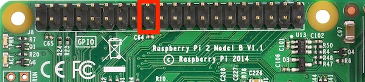

# Photobooth (FotoBox) for Raspberry Pi, Linux and macOS  

## features

* support a variety of different [DSLR cameras](http://www.gphoto.org/proj/libgphoto2/support.php)
* trigger photos directly or start a countdown by touching or clicking the screen, using soft-/hardware buttons, keyboard shortcuts or a presenter
* lightning fast and low-memory Linux and macOS customizable application

## Raspberry Pi installation

1. [Raspberry Pi model >=2](https://www.raspberrypi.org/products/) with [Raspbian](https://www.raspberrypi.org/downloads/noobs/) (__'Stretch' recommended__) installed. To update to latest [Raspbian version](https://en.wikipedia.org/wiki/Raspbian), run this commands in [Terminal](https://www.raspberrypi.org/documentation/usage/terminal/): `sudo apt-get update && sudo apt-get upgrade && sudo apt-get dist-upgrade`
2. Download and install the [Qt](https://www.qt.io) library with [Terminal](https://www.raspberrypi.org/documentation/usage/terminal/) command: `sudo apt-get install qt5-default`
3. Set up DSLR and/or official [Camera Module V2](https://www.raspberrypi.org/products/camera-module-v2/)
    * [gPhoto2 and libgphoto2 compiler and installer script](http://github.com/gonzalo/gphoto2-updater) to get latest [gPhoto2](http://gphoto.org) (__recommended__) or use latest
    * [activate Raspberry Pi Camera](https://www.raspberrypi.org/documentation/usage/camera/)
4. Download latest "__FotoBox__" application [here](https://gitlab.com/tomikais/fotobox/tags) according to your [Raspbian version](https://en.wikipedia.org/wiki/Raspbian) ('Stretch' recommended because not all features are available in 'Jessie')
5. Start the application and configure it accordingly.

## optional steps

* _Disable the screen saver_: `sudo apt-get install xscreensaver`, run `xhost +localhost` from a local terminal session (not SSH) and reboot the system. After that you can launch the *Screensaver* application and select *disable screen saver* from the drop down.
* _Autostart_: open file with `sudo nano /etc/xdg/lxsession/LXDE-pi/autostart` add this line `@/home/pi/Downloads/FotoBox` (__adjust path if necessary__) at the end of the file.
* _Using a button_: It's possible to connect a button to the Raspberry Pi GPIO ([WiringPi](http://wiringpi.com)) pins to trigger the FotoBox. You can configure [dedicated pins](http://wiringpi.com/pins/) in the applicatuion or use the programm default ones:  

## keyboard shortcuts

| key                                                              | action            |
|------------------------------------------------------------------|-------------------|
| `N`, `Enter`, `Page Up/Down`, `Arrow Keys`, `Space`, `Backspace` | start FotoBox     |
| `P`, `S`, `E`                                                    | preference dialog |
| `Shift` + `Escape`, `Q`                                          | quit application  |

## FotoBox community

* [german Raspberry Pi Forum](https://forum-raspberrypi.de/forum/thread/39672-fotobox-projekt-fuer-den-raspberry-pi-c-qt-wiringpi-gphoto2/)
* [official Raspberry Pi Forum](https://www.raspberrypi.org/forums/viewtopic.php?t=218279)

---

## development 

### update Raspbian and firmware

Raspbian: `sudo apt-get update && sudo apt-get upgrade && sudo apt-get dist-upgrade`  
firmware: `sudo rpi-update`

### Qt

`sudo apt-get install qt5-default qttools5-dev-tools qtdeclarative5-dev qtcreator qt5-doc ccache`  
set GCC compiler path in Qt Creator:

* gcc C: `/usr/bin/gcc`
* gcc C++: `/usr/bin/g++`

### wiringPi

`sudo apt-get install wiringpi` (pre-installed Raspbian >=Stretch)

### source code

Prepare git client: `sudo apt-get install gitk git-gui git-doc`  
GitLab source code: `git clone --recursive git@gitlab.com:tomikais/fotobox.git` or `https://gitlab.com/tomikais/fotobox.git`

### gphoto2 and libgphoto2

`chmod +x ./gphoto2-updater/gphoto2-updater.sh && sudo ./gphoto2-updater/gphoto2-updater.sh`
